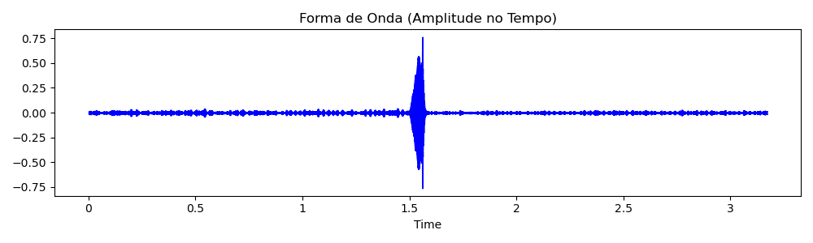
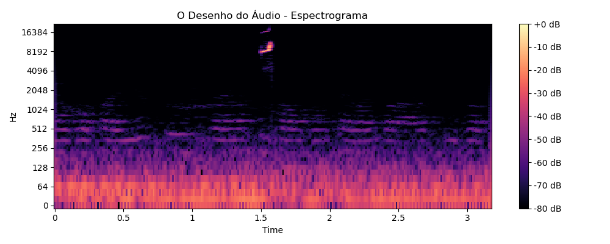
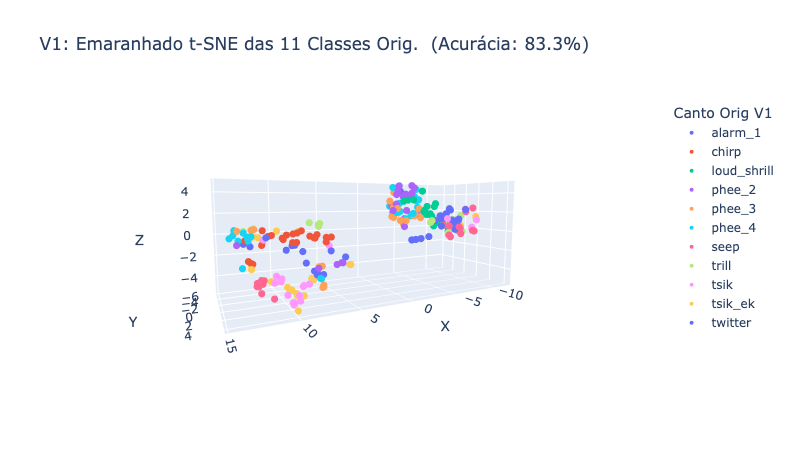
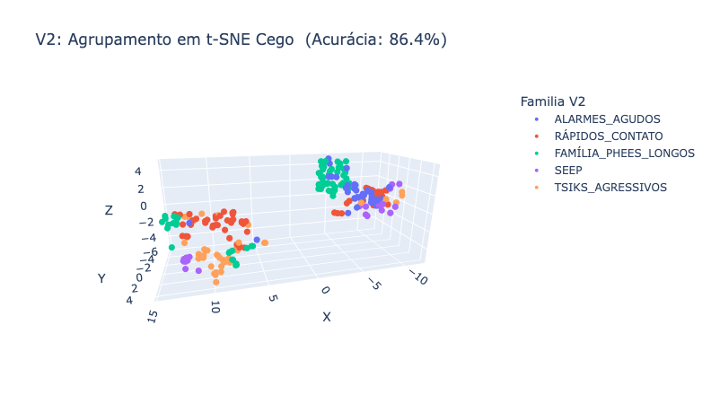
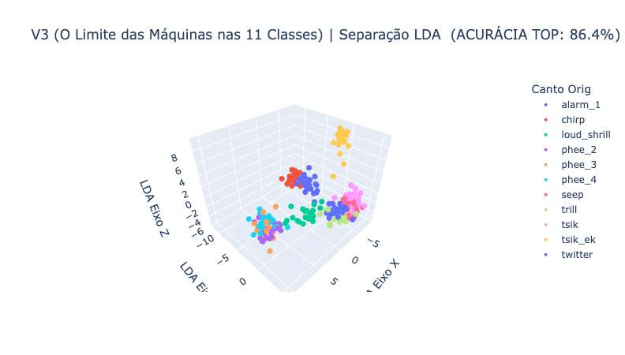
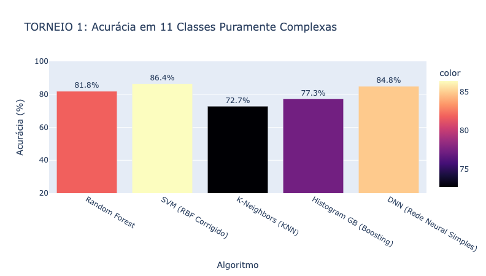
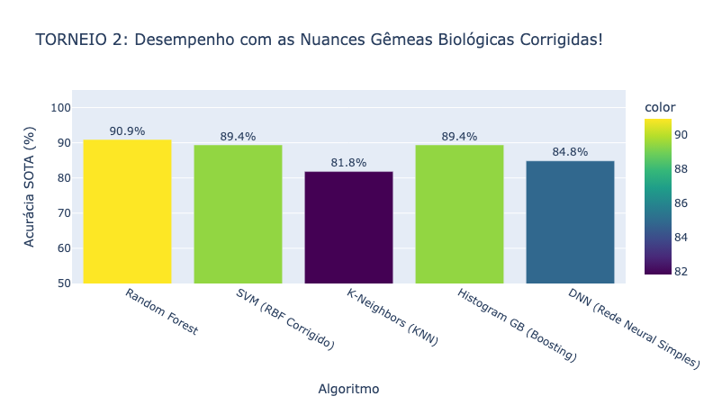

# Tradutor Sagui / Humano 🐵🎙️

Um projeto de Ciência de Dados e Bioacústica Computacional estado-da-arte, criado para classificação, mapeamento 3D e **tradução em tempo real** de vocalizações de saguis (*Callithrix jacchus*).

---

## 🚀 A Jornada de Desenvolvimento

Este projeto evoluiu de uma simples curiosidade sobre sinais sonoros para um ecossistema de tradução robusto. Abaixo detalhamos as etapas que levaram à acurácia de ponta.

### 1. Entendendo as Ondas (Domínio do Tempo e Frequência)
Nossa primeira parada foi analisar como o som "se parece". Convertemos as vibrações brutas em assinaturas visuais rítmicas.

| O Formato de Onda (Tempo) | O Espectrograma (Frequência) |
| :--- | :--- |
|  |  |

---

### 2. A Evolução da Inteligência (Mapeamento 3D)

Através da técnica de **Gravidade Magnética (LDA)** e **Super-Features**, forçamos os áudios a se separarem em constelações isoladas no espaço 3D.

#### V1: O Caos Inicial
Mesmo com características básicas, os cantos originais rudes estavam todos emaranhados.

#### V2: Agrupamento Biológico
Unindo classes por famílias de sentimento, ganhamos clareza técnica, mas a separação visual ainda era tímida.

#### V3: O Poder das Super-Features
Injetamos MFCCs, Chromagramas e Contrastes Espectrais. O mapa se torna visivelmente mais limpo e organizado.

---

### 3. Torneio de Algoritmos (AutoML Mode)

Testamos o "cérebro" das máquinas contra o nosso banco de dados. O **SVM (Support Vector Machine)** corrigido escalou para o topo da cadeia evolutiva.

| Acurácia das 11 Classes | Acurácia SOTA (Famílias Biológicas) |
| :--- | :--- |
|  |  |

---

### 4. O Tradutor Símio (Simulação em Produção)

Transformamos toda essa matemática em uma interface real. Você pode subir um arquivo `.wav` ou **falar diretamente no microfone** do seu Mac!

| Interface de Upload | Monitoramento ao Vivo (Com Noise Gate) |
| :--- | :--- |
|  |  |

---

## 📖 Dicionário de Emoções do *Callithrix jacchus*:

| Som Biológico | Tradução / Sentimento | O Que o Sagui Disse? |
| :--- | :--- | :--- |
| **FAMÍLIA_PHEES_LONGOS** | 📞 Chamado de Contato Longe | *"Onde vocês estão? / Resposta longa!"* |
| **TSIKS_AGRESSIVOS** | 🤬 Agressão / Conflito | *"Fique Longe! / Ameaça!"* |
| **RÁPIDOS_CONTATO** | 👋 Conversação Curta | *"Venham comer! / Tô por perto"* |
| **ALARMES_AGUDOS** | 🦅 Alerta Predador | *"CUIDADO! Corram!"* |
| **SEEP** | 🍼 Filhote/Pedinte | *"Mãe, socorro! / Quero atenção"* |

---

## 🛠️ Como Rodar
1. Clone o repositório.
2. Certifique-se de ter as bibliotecas `librosa`, `sklearn`, `plotly`, `sounddevice` e `ipywidgets` instaladas.
3. Abra o notebook `notebooks/sagui-human.ipynb` e rode todas as células.
4. Use o microfone ou uploader no final do notebook!

---
_A natureza não fala em binário, mas agora a gente escuta a matemática dela. 🏆_
